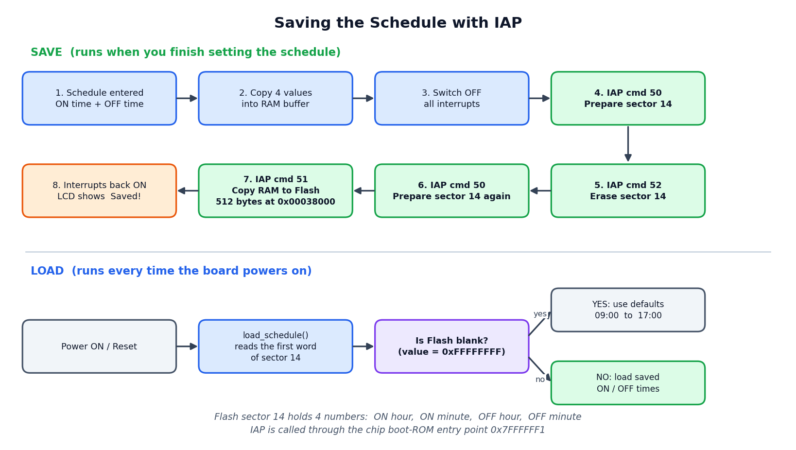

# ⏰ Menu-Driven RTC with Scheduled Device Control

**A PIN-protected clock and timer on the LPC2148.** It shows the time, switches a device ON and OFF by schedule, and everything is set from a keypad and a 16x2 LCD.

-green)

### 🎬 Demo Video

https://github.com/user-attachments/assets/9d869117-7c4b-4324-b156-afd8947410ed

---

## 📖 Chapter 1 — The Idea

Most simple timers can't be changed without re-programming the chip. This project can.

Press one button, enter a 4-digit PIN, and a menu opens. From there you can set the **time**, the **date**, the **ON/OFF schedule** and the **PIN**, all from the keypad. The schedule is saved in the chip's own Flash memory using **IAP (In-Application Programming)**, so it survives a power cut.

---

## 🧩 Chapter 2 — The Hardware

| Part | Job |
|---|---|
| LPC2148 (ARM7) | The brain: RTC, timers, interrupt |
| **IAP** (inside the LPC2148) | Saves the ON/OFF schedule in the chip's own Flash memory |
| 16x2 LCD | Shows the clock and all the menus |
| 4x4 Keypad | Numbers, backspace and confirm |
| Trigger button (EINT0) | Wakes up the PIN screen |
| LED | The "device" that switches ON/OFF |

**Wiring:**

---

## 🔄 Chapter 3 — The Flow

In one line: **Startup → Clock ⇄ Schedule → press button → PIN → Menu → set things → back to Clock.**

---

## 🖥️ Chapter 4 — The Screens

Here is what you see on the LCD, in order.

<table>
<tr>
<td align="center"> <b>1. Startup</b> Shown for 1 second</td>
<td align="center"> <b>2. Clock</b> Time, day and date</td>
</tr>
<tr>
<td align="center"> <b>3. Schedule</b> Appears now and then for 1 second</td>
<td align="center"> <b>4. PIN</b> After pressing the trigger button</td>
</tr>
<tr>
<td align="center"> <b>5. Main menu</b> RTC / SCH / More / Exit</td>
<td align="center"> <b>6. Edit time</b> Set the hour or the minute</td>
</tr>
<tr>
<td align="center"> <b>7. Set schedule</b> ON time, then OFF time</td>
<td align="center"> <b>8. More</b> Date or PIN</td>
</tr>
<tr>
<td align="center"> <b>9. Edit date</b> DD / MM / YY / Day</td>
<td align="center"> <b>10. Change PIN</b> Enter the new PIN twice</td>
</tr>
</table>

---

## 🎮 Chapter 5 — How to Use It

1. Power on. The clock appears.
2. Press the **trigger button**, then type the PIN (default **7777**) and press the **confirm key**.
3. Pick from the menu with the number keys:
   - **1. RTC** sets the hour or minute
   - **2. SCH** sets the ON and OFF time
   - **3. More** sets the date or changes the PIN
   - **4. Exit** goes back to the clock

**Keypad guide**

| Key | What it does |
|---|---|
| 1 to 9 | Number keys |
| Any key in the right-hand column | Number **0** |
| Row 4, column 1 | **Backspace** |
| Row 4, column 2 | **Confirm** (PIN entry only) |

**Good to know**
- Hour, minute and day take **2 digits**, so type `09` for 9. The year takes 4 digits.
- **3 wrong PINs** locks the system for 10 seconds.
- **The device turns ON** at the ON time and **OFF** at the OFF time. If OFF is earlier than ON, the schedule runs overnight.
- Press the trigger button inside any menu to return to the clock.

---

## 💾 Chapter 6 — Saving with IAP

Anything kept in RAM disappears when the power goes off. To keep the **ON/OFF schedule**, this project uses **IAP (In-Application Programming)**: the LPC2148 re-writes a part of its **own Flash memory** while the program is running, and reads it back at the next power-on.

**Where the schedule lives**

| Word | Address (Flash sector 14) | What it holds |
|---|---|---|
| 0 | `0x00038000` | ON hour |
| 1 | `0x00038004` | ON minute |
| 2 | `0x00038008` | OFF hour |
| 3 | `0x0003800C` | OFF minute |

**How a save works** (runs after all four values are typed)

| Step | IAP command | What it does |
|---|---|---|
| 1 | 50 | Prepare sector 14 for writing |
| 2 | 52 | Erase sector 14 (Flash must be erased before it is written) |
| 3 | 50 | Prepare sector 14 again |
| 4 | 51 | Copy the RAM buffer into Flash (512 bytes) |

**How a load works**
At every power-on, `load_schedule()` reads the first word of sector 14. A blank Flash reads `0xFFFFFFFF`, so the default **09:00 to 17:00** is used. Otherwise the saved times are loaded.

**Good to know**
- All interrupts are switched off while Flash is being written, and the trigger button (EINT0) is switched back on afterwards.
- Nothing is written if you press the trigger button before finishing the four values.
- Only the schedule is saved in Flash. The PIN and the clock are not.
- The code assumes **CCLK = 60 MHz**, because that value is passed to the erase and write commands.
- In the code: `save_schedule()` and `load_schedule()` in `rtc_fun.c`. IAP is called through the boot-ROM address `0x7FFFFFF1`.

---

## 🛠️ Chapter 7 — Build and Run

1. Clone the repo: `git clone https://github.com/Yugesh17repo/LPC2148-Menu_Driven_RTC.git`
2. In Keil, create a new project for **LPC2148** and add the `.c` files from the source folder.
3. Set up the clock so **CCLK = 60 MHz** and **PCLK = 15 MHz** (the delays and timers in the code assume this). Then build to create the `.hex` file.
4. Open **Flash Magic**, choose LPC2148 and your COM port, load the `.hex`, put the board's ISP switch in **LOAD** mode, press **RST** and click **Start**.
5. Switch back to **RUN**, press **RST**, and the startup screen appears.

---

## 🧪 Chapter 8 — Testing Checklist

Run these tests on the board and tick each one when it passes.

| # | Test | Expected Result | Pass |
|---|------|-----------------|:----:|
| 1 | Power on the board | LCD shows **RTC DRIVERS PROJECT** for about 1 second, then the clock | ☐ |
| 2 | Wait about 6 seconds on the clock | The **ON / OFF schedule** screen shows for about 1 second, then the clock returns | ☐ |
| 3 | Press the trigger button | **Enter PIN:** appears | ☐ |
| 4 | Type a wrong PIN and press the confirm key | **Wrong PIN!** with **Attempt's lft:2** | ☐ |
| 5 | Type the wrong PIN 3 times | **System Hang!..** with a **Wait** counter up to 10 s, then the clock returns | ☐ |
| 6 | Type 4 digits, then press Backspace | The last `*` is removed and you can retype it | ☐ |
| 7 | Type the correct PIN (default `7777`) and confirm | **Access Granted**, then the main menu | ☐ |
| 8 | Menu **1. RTC → 1**, type `10` | **Saved!** and the clock shows hour 10 | ☐ |
| 9 | Menu **1. RTC → 2**, type `30` | **Saved!** and the clock shows minute 30 | ☐ |
| 10 | Menu **2. SCH**: ON = 09:00, OFF = 17:00, clock time 12:00 | LED **ON** | ☐ |
| 11 | Same schedule, clock time 18:00 | LED **OFF** | ☐ |
| 12 | ON = 22:00, OFF = 06:00, clock time 23:30 or 03:00 | LED **ON** (overnight) | ☐ |
| 13 | ON = 22:00, OFF = 06:00, clock time 12:00 | LED **OFF** | ☐ |
| 14 | Reset the board after saving a schedule | The same ON/OFF times are still there (saved in Flash with IAP) | ☐ |
| 15 | Menu **3. More → 1. Date → 1. DD**, type `31` in a 30-day month | **Invalid Day!**, old date kept | ☐ |
| 16 | Set Feb `29` in a leap year (for example 2028) | Accepted. In a non-leap year (for example 2027): **Invalid Day!** | ☐ |
| 17 | Menu **3. More → 1. Date → 4. DoW**, press `6` | The clock shows **SAT** | ☐ |
| 18 | Menu **3. More → 2. Pass**, type the same new PIN twice | **PIN Saved!**, and the new PIN works next time | ☐ |
| 19 | Menu **3. More → 2. Pass**, type two different PINs | **Mismatch!** and the old PIN stays | ☐ |
| 20 | Press the trigger button inside any menu | Back to the clock view | ☐ |

---

## 🩺 Chapter 9 — Troubleshooting

| Problem | Possible Cause | What to Do |
|---------|----------------|------------|
| LCD is blank or shows only dark boxes | Contrast not set, or no power | Turn the LCD's contrast pot slowly; check the board's power LED |
| LCD shows garbage characters | Data wires in the wrong order | Check D0–D7 → **P0.8–P0.15**, RS → **P0.17**, EN → **P0.18**, RW → **P0.19** |
| Flash Magic cannot connect | Board not in ISP mode, or wrong settings | ISP switch to **LOAD**, press **RST**; check the COM port, baud rate and oscillator = 12 MHz |
| Keys give wrong digits or nothing | Rows / columns swapped or a loose wire | Rows → **P1.16–P1.19**, columns → **P1.20–P1.23**; see the [keypad guide](#-chapter-5--how-to-use-it) |
| Can't type the digit `0` | It has no key of its own | Press **any key in the right-hand column** |
| Trigger button does nothing | Wiring, or the system is in lockout | Check the wire to **P0.16 (EINT0)**; during the 10-second lockout the button is ignored |
| PIN not accepted | Wrong digits, or the confirm key was not pressed | Type 4 digits, then press the **confirm** key (row 4, column 2). Default PIN is `7777` |
| **System Hang!..** on the LCD | 3 wrong PINs in a row | This is the lockout. Wait for the counter to reach 10 s |
| Schedule screen never appears | ON hour and OFF hour are the same | It only shows when the ON hour differs from the OFF hour |
| LED never turns ON | Time is outside the window, or ON = OFF | Check the schedule. If ON and OFF are the same time, the device stays OFF. Also check the LED wire on **P0.7** |
| Time or date wrong after power off | RTC never set, or no backup cell | Set it from the menu and keep the board's backup cell fitted |
| Wrong day name on the clock | Day of week was not set | Menu **3. More → 1. Date → 4. DoW** (`0` = Sunday, `6` = Saturday) |
| Delays and the lockout counter run too fast or slow | Clock speed is not what the code expects | Set **CCLK = 60 MHz** and **PCLK = 15 MHz** in the startup file (see Chapter 7) |
| **ERROR1** appears when saving the schedule | The first IAP step (prepare sector 14) failed | Reset and try again. If it repeats, check that CCLK is 60 MHz (see [Chapter 6](#-chapter-6--saving-with-iap)) |
| Saved schedule disappears after re-flashing | "Erase all Flash" also clears the saved schedule | In Flash Magic choose **Erase blocks used by Hex file** |

---

## 📁 Chapter 10 — The Files

| File | What's inside |
|---|---|
| `rtc_init.c` | `main()`: starts everything |
| `rtc_fun.c` | The brain: menus, PIN, schedule, RTC, and the **IAP** Flash save and load |
| `LCD.c` | LCD setup and text output |
| `KEY_FUN.c` | Keypad scanning |
| `interrupt.c` | Trigger button interrupt (EINT0) |
| `timers.c` | Delay functions |
| `proto.h` | Pin definitions and function list |

---

## 🔭 Epilogue — Limits and What's Next

- Hour, minute and schedule entries are not range-checked (the date is).
- The PIN lives in RAM, so it goes back to **7777** after a reset.
- Pressing the trigger button in the middle of typing a value can set that value to 0.
- **Ideas:** save the PIN in Flash too (same IAP method), add a menu timeout, edit seconds, add a buzzer alert.

---

## 👤 Author

**Yugesh Roshan**: [@Yugesh17repo](https://github.com/Yugesh17repo)
