# ⏰ Menu-Driven RTC with Scheduled Device Control

**A PIN-protected clock and timer on the LPC2148.** It shows the time, switches a device ON and OFF by schedule, and everything is set from a keypad and a 16x2 LCD.

-green)

### 🎬 Demo Video

👉 **[Watch the demo video](ADD_YOUR_VIDEO_LINK_HERE)**

---

## 📖 Chapter 1 — The Idea

Most simple timers can't be changed without re-programming the chip. This project can.

Press one button, enter a 4-digit PIN, and a menu opens. From there you can set the **time**, the **date**, the **ON/OFF schedule** and the **PIN**, all from the keypad. The schedule is saved in Flash, so it survives a power cut.

---

## 🧩 Chapter 2 — The Hardware

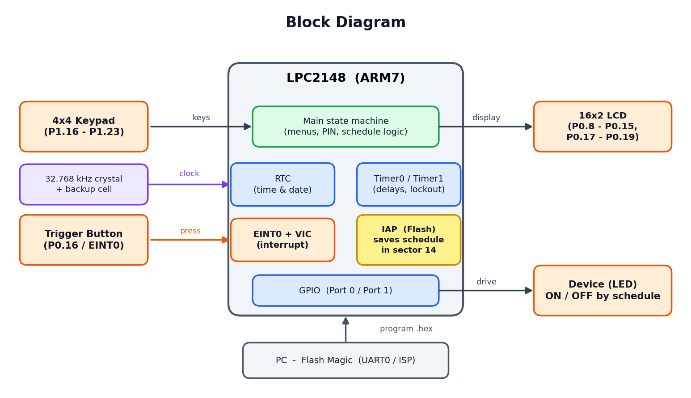

| Part | Job |
|---|---|
| LPC2148 (ARM7) | The brain: RTC, timers, interrupt, Flash |
| 16x2 LCD | Shows the clock and all the menus |
| 4x4 Keypad | Numbers, backspace and confirm |
| Trigger button (EINT0) | Wakes up the PIN screen |
| LED | The "device" that switches ON/OFF |

**Wiring:**

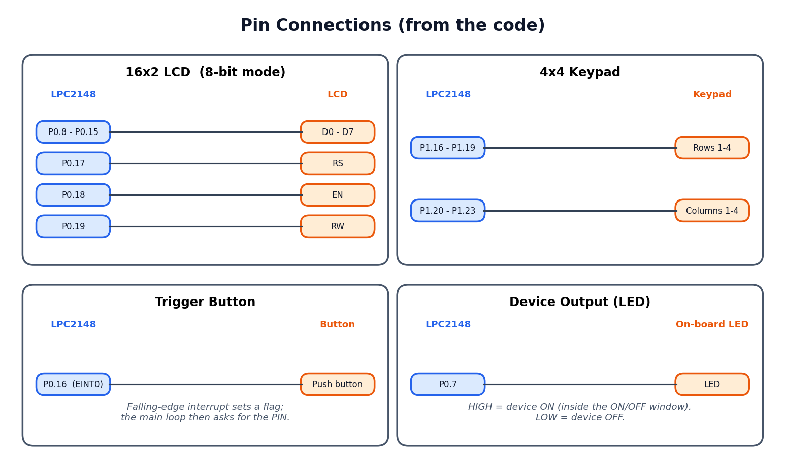

---

## 🔄 Chapter 3 — The Flow

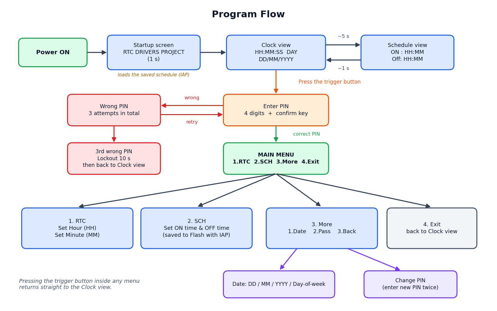

In one line: **Startup → Clock ⇄ Schedule → press button → PIN → Menu → set things → back to Clock.**

---

## 🖥️ Chapter 4 — The Screens

Here is what you see on the LCD, in order.

<table>
<tr>
<td align="center">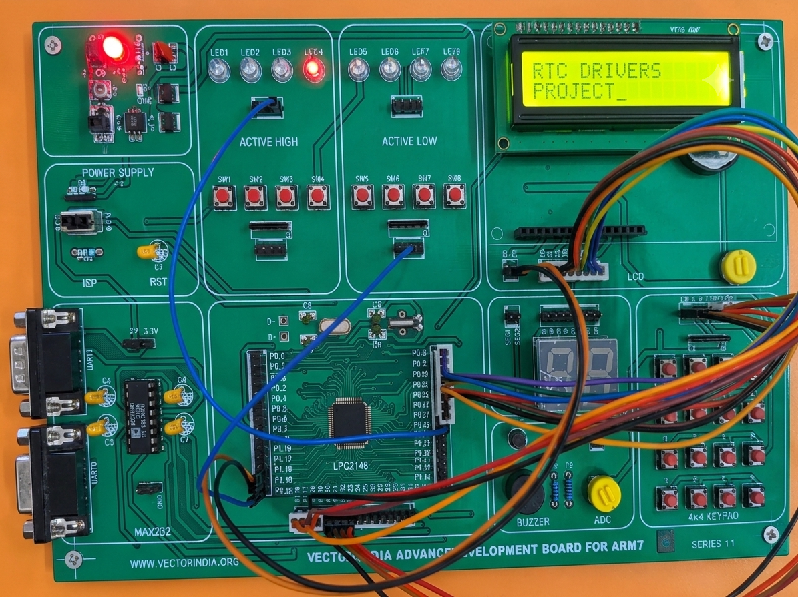 <b>1. Startup</b> Shown for 1 second</td>
<td align="center">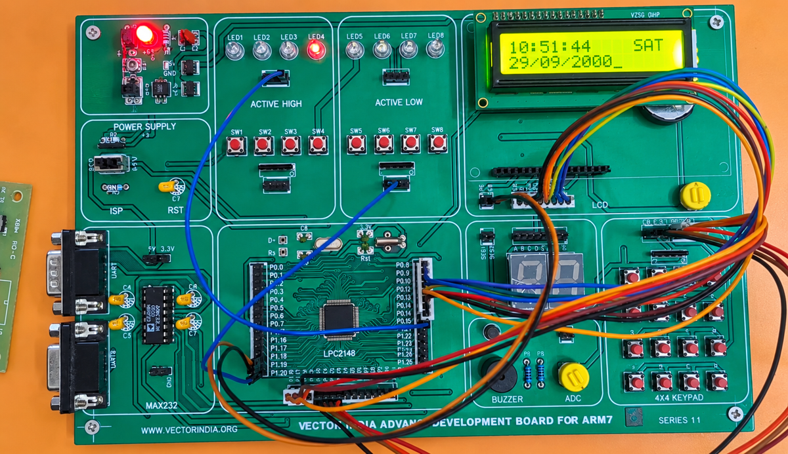 <b>2. Clock</b> Time, day and date</td>
</tr>
<tr>
<td align="center">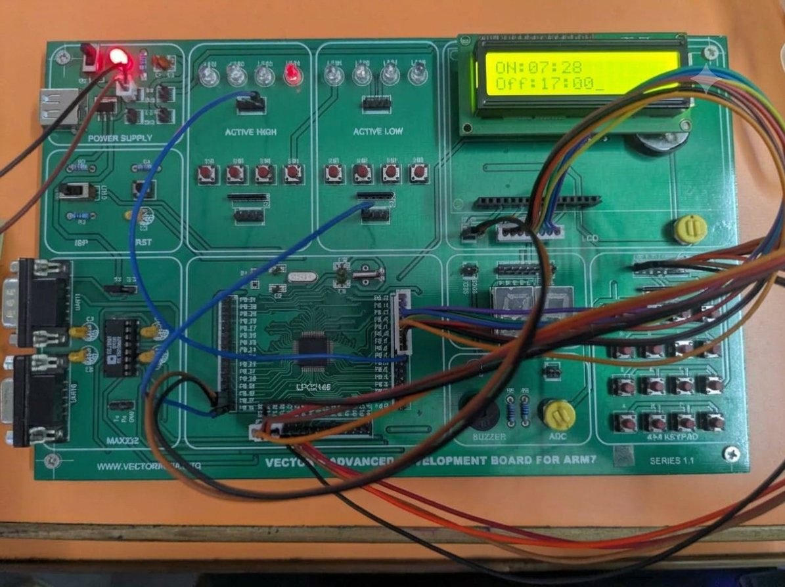 <b>3. Schedule</b> Appears now and then for 1 second</td>
<td align="center">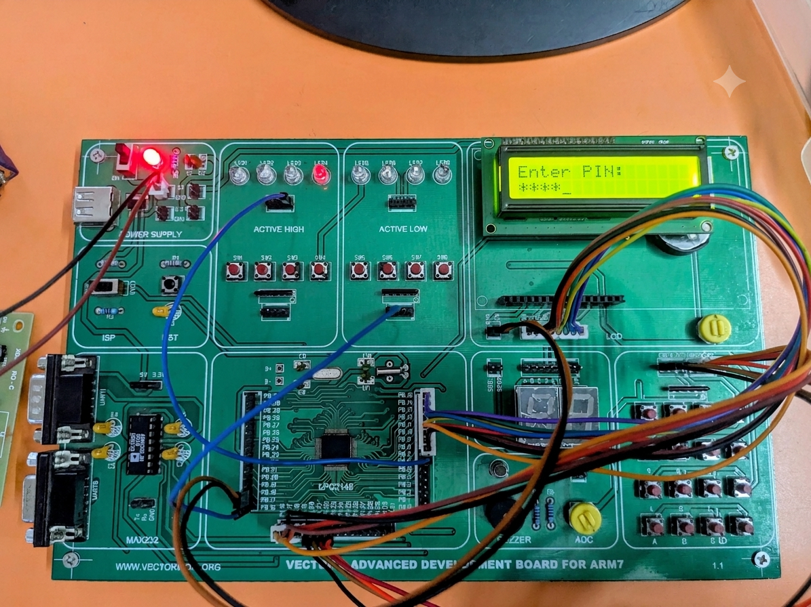 <b>4. PIN</b> After pressing the trigger button</td>
</tr>
<tr>
<td align="center">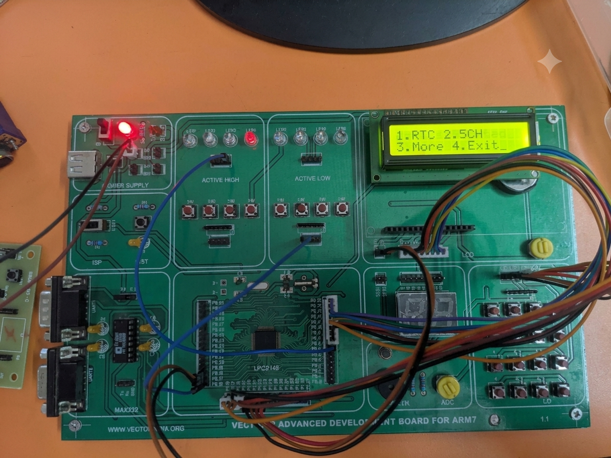 <b>5. Main menu</b> RTC / SCH / More / Exit</td>
<td align="center">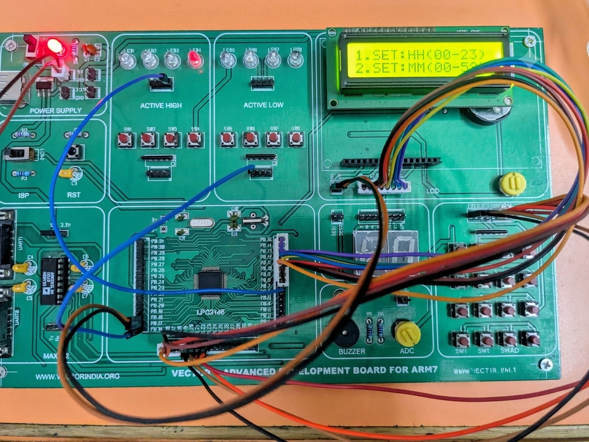 <b>6. Edit time</b> Set the hour or the minute</td>
</tr>
<tr>
<td align="center">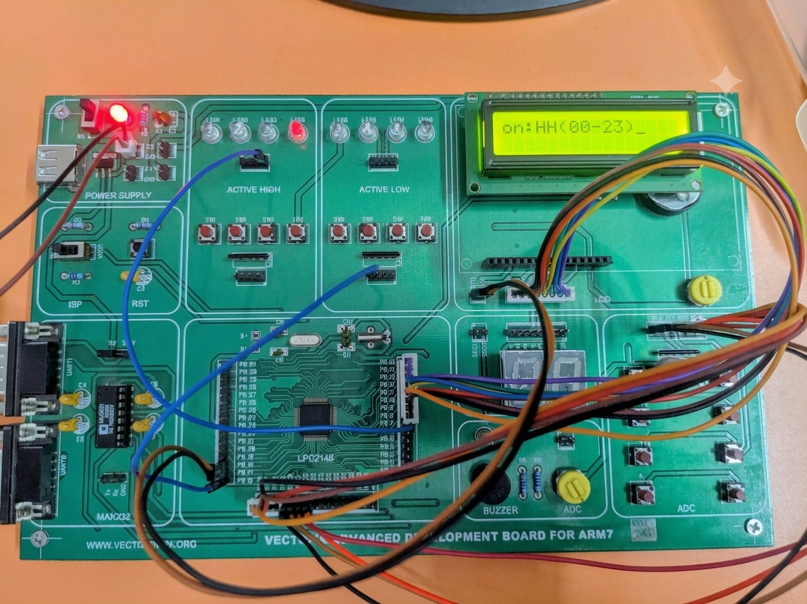 <b>7. Set schedule</b> ON time, then OFF time</td>
<td align="center">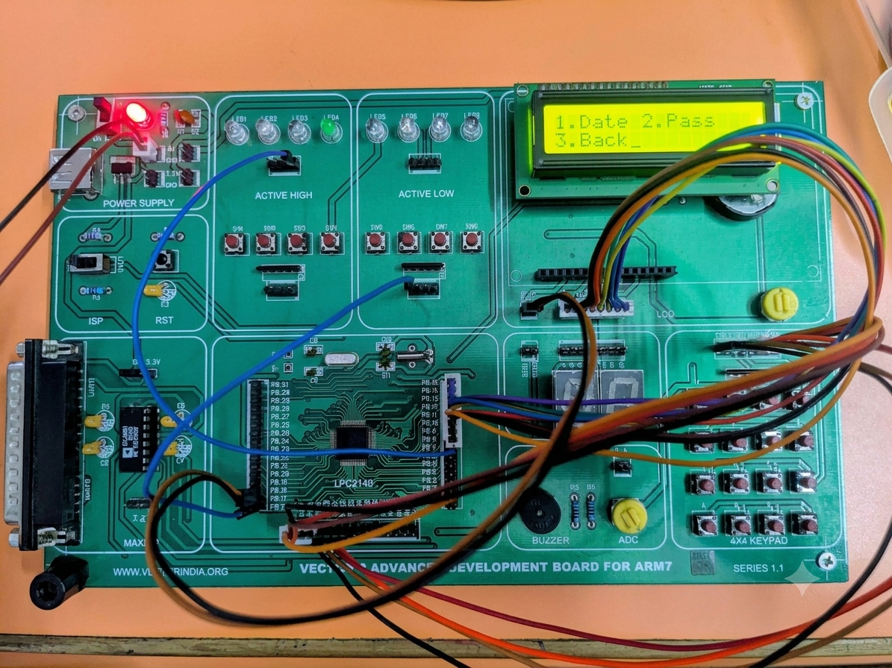 <b>8. More</b> Date or PIN</td>
</tr>
<tr>
<td align="center">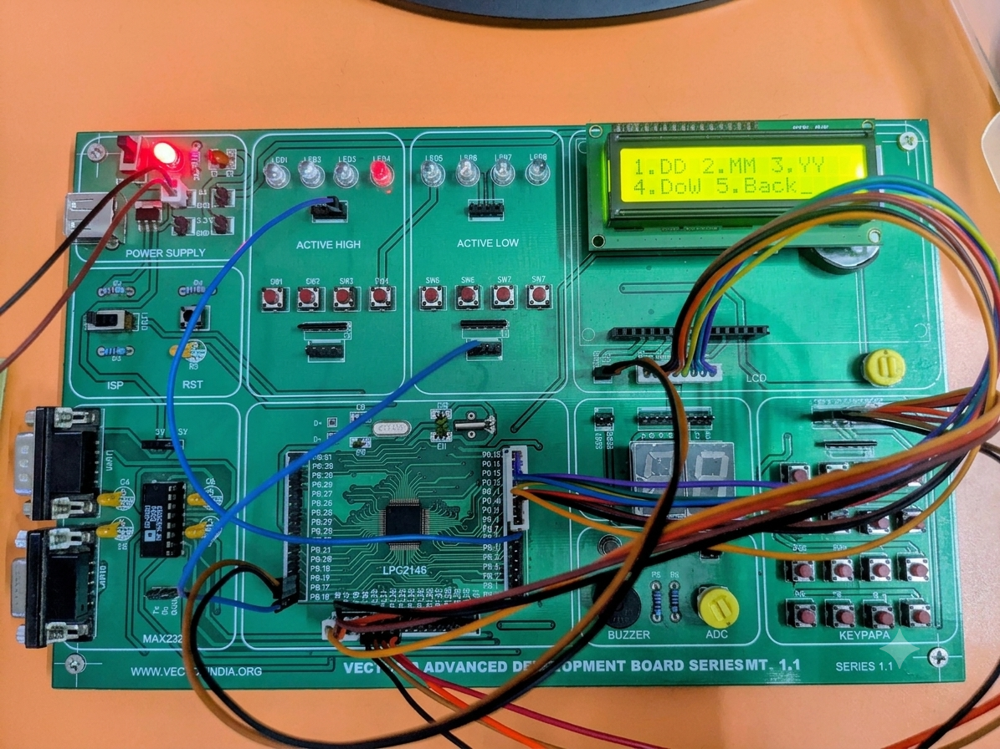 <b>9. Edit date</b> DD / MM / YY / Day</td>
<td align="center">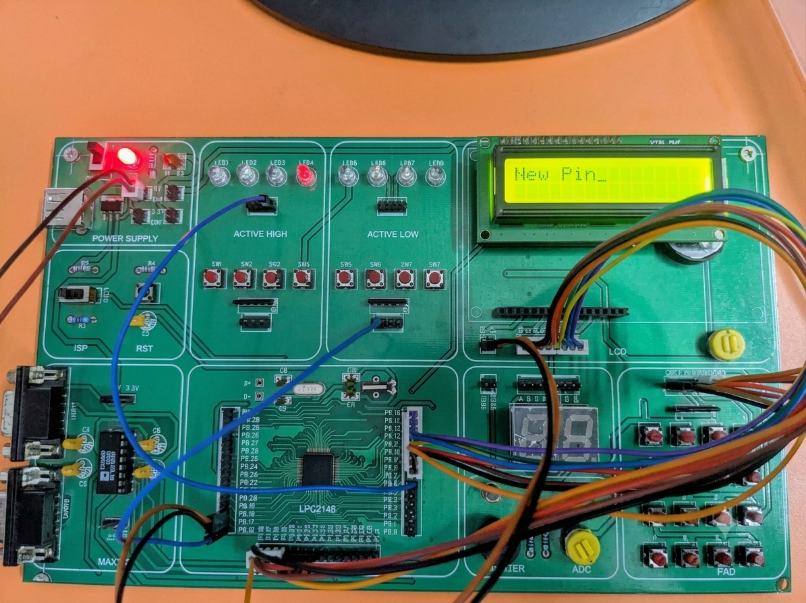 <b>10. Change PIN</b> Enter the new PIN twice</td>
</tr>
</table>

---

## 🎮 Chapter 5 — How to Use It

1. Power on. The clock appears.
2. Press the **trigger button**, then type the PIN (default **7777**) and press the **confirm key**.
3. Pick from the menu with the number keys:
   - **1. RTC** sets the hour or minute
   - **2. SCH** sets the ON and OFF time
   - **3. More** sets the date or changes the PIN
   - **4. Exit** goes back to the clock

**Keypad guide**

| Key | What it does |
|---|---|
| 1 to 9 | Number keys |
| Any key in the right-hand column | Number **0** |
| Row 4, column 1 | **Backspace** |
| Row 4, column 2 | **Confirm** (PIN entry only) |

**Good to know**
- Hour, minute and day take **2 digits**, so type `09` for 9. The year takes 4 digits.
- **3 wrong PINs** locks the system for 10 seconds.
- **The device turns ON** at the ON time and **OFF** at the OFF time. If OFF is earlier than ON, the schedule runs overnight.
- Press the trigger button inside any menu to return to the clock.

---

## 🛠️ Chapter 6 — Build and Run

1. Clone the repo: `git clone https://github.com/Yugesh17repo/LPC2148-Menu_Driven_RTC.git`
2. In Keil, create a new project for **LPC2148** and add the `.c` files from the source folder.
3. Set up the clock so **CCLK = 60 MHz** and **PCLK = 15 MHz** (the delays and timers in the code assume this). Then build to create the `.hex` file.
4. Open **Flash Magic**, choose LPC2148 and your COM port, load the `.hex`, put the board's ISP switch in **LOAD** mode, press **RST** and click **Start**.
5. Switch back to **RUN**, press **RST**, and the startup screen appears.

---

## 📁 Chapter 7 — The Files

| File | What's inside |
|---|---|
| `rtc_init.c` | `main()`: starts everything |
| `rtc_fun.c` | The brain: menus, PIN, schedule, RTC and Flash save |
| `LCD.c` | LCD setup and text output |
| `KEY_FUN.c` | Keypad scanning |
| `interrupt.c` | Trigger button interrupt (EINT0) |
| `timers.c` | Delay functions |
| `proto.h` | Pin definitions and function list |

---

## 🔭 Epilogue — Limits and What's Next

- Hour, minute and schedule entries are not range-checked (the date is).
- The PIN lives in RAM, so it goes back to **7777** after a reset.
- Pressing the trigger button in the middle of typing a value can set that value to 0.
- **Ideas:** save the PIN in Flash, add a menu timeout, edit seconds, add a buzzer alert.

---

## 👤 Author

**Yugesh**: [@Yugesh17repo](https://github.com/Yugesh17repo)
