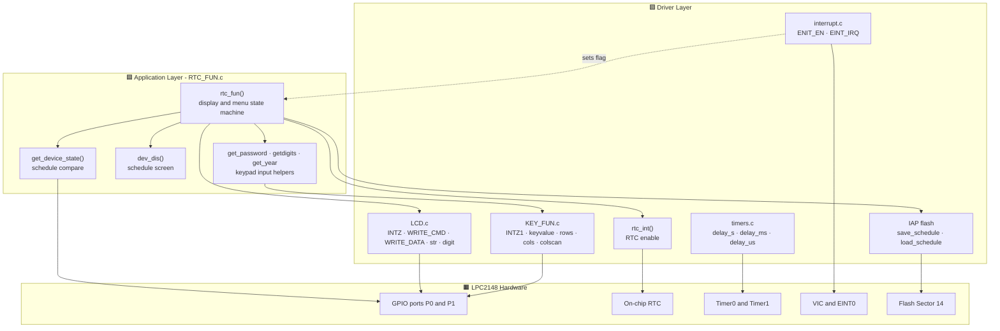
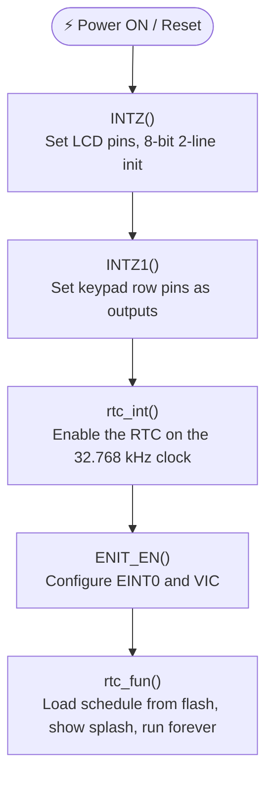
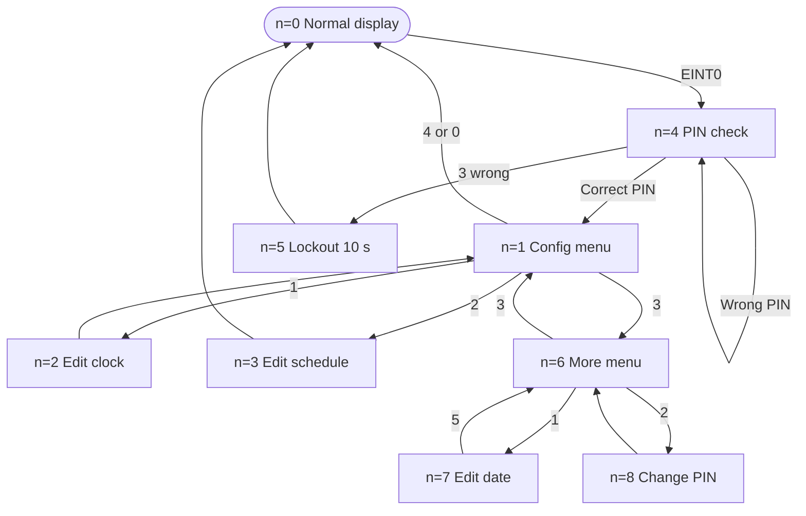
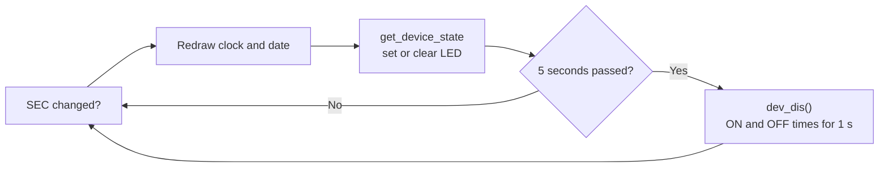
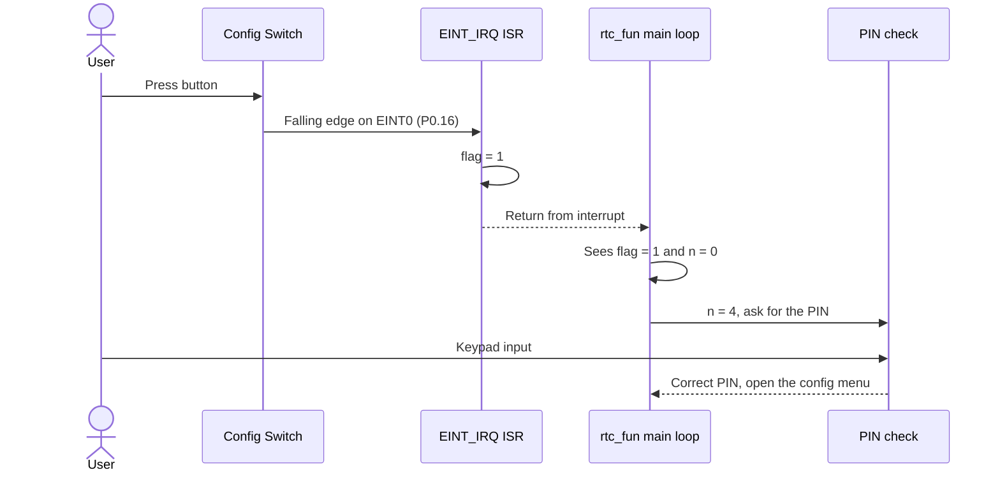
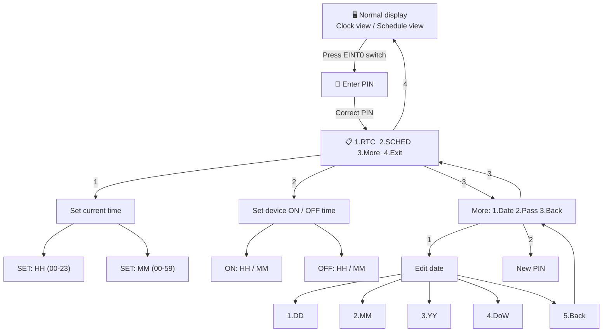
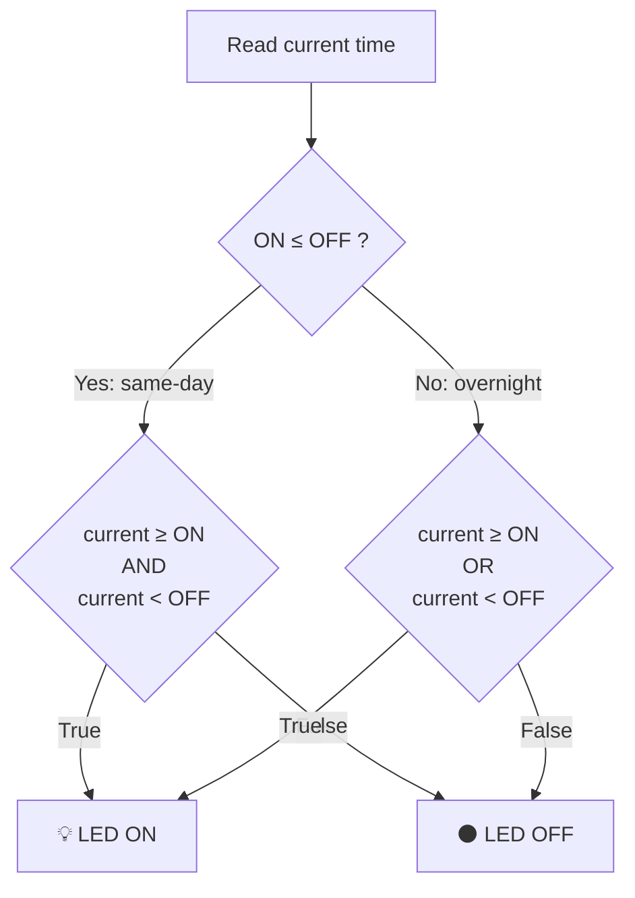
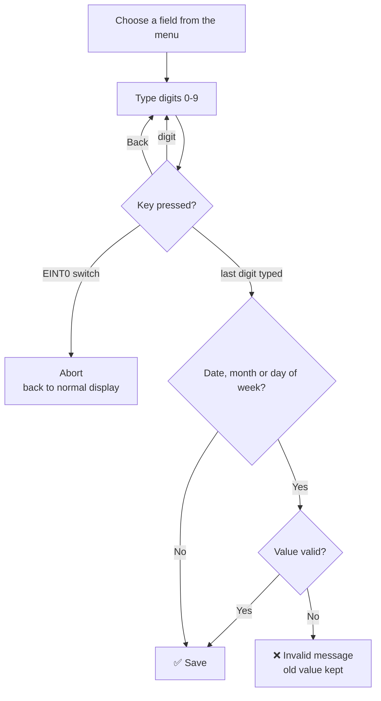

# ⏰ Menu-Driven RTC Configuration and Scheduled Device Control System

-blue)


An embedded automation project built on the **NXP LPC2148 (ARM7 TDMI-S)** microcontroller.

The system shows the **real-time date and time** on a 16×2 LCD. You can **set the clock**, the **date** and a **daily ON/OFF schedule** using a 4×4 keypad menu that is **protected by a 4-digit PIN**. The system then **switches a device automatically** (an LED stands in for the device) according to your schedule.

---

## 🚀 Project at a Glance

| | |
|---|---|
| **What it does** | Shows clock → lets you configure it → controls a device by schedule |
| **Brain** | LPC2148 (ARM7, 60 MHz) with on-chip RTC |
| **Input** | 4×4 keypad + one configuration push-button (EINT0, opens the PIN prompt) |
| **Output** | 16×2 LCD + LED (device) |
| **Language / Tool** | Embedded C · Keil µVision · Flash Magic |
| **Source files** | `src/` folder: `rtc_int.c`, `RTC_FUN.c`, `LCD.c`, `KEY_FUN.c`, `interrupt.c`, `timers.c`, `proto.h` |

---

## 📑 Table of Contents

- [Aim](#-aim)
- [Objectives](#-objectives)
- [Features](#-features)
- [Block Diagram](#-block-diagram)
- [Hardware Requirements](#-hardware-requirements)
- [Software Requirements](#-software-requirements)
- [Pin Mapping](#-pin-mapping)
- [Circuit Connections](#-circuit-connections)
- [Getting Started](#-getting-started)
- [Firmware Architecture](#-firmware-architecture)
- [Project Workflow](#-project-workflow)
- [What You See on the LCD](#-what-you-see-on-the-lcd)
- [LCD Output Gallery](#-lcd-output-gallery)
- [Menu System](#-menu-system)
- [Keypad Guide](#-keypad-guide)
- [Schedule Logic](#-schedule-logic)
- [Input Validation](#-input-validation)
- [Testing Checklist](#-testing-checklist)
- [Troubleshooting](#-troubleshooting)
- [Project Structure](#-project-structure)
- [Source Code Overview](#-source-code-overview)
- [Technical Specifications](#-technical-specifications)
- [Known Limitations](#-known-limitations)
- [Future Enhancements](#-future-enhancements)
- [License](#-license)

---

## 🎯 Aim

To develop a **menu-driven RTC configuration and scheduled device control system** using the LPC2148 microcontroller.

The system:
- Displays the current date and time on an LCD
- Lets the user configure RTC settings and device ON/OFF times through keypad-operated menus
- Automatically switches the device ON and OFF according to the user-defined daily schedule

---

## 📋 Objectives

1. Display RTC information (date, time, and day of week) on a 16×2 LCD.
2. Allow users to modify RTC settings (Hour, Minute, Day, Date, Month, Year) using a 4×4 matrix keypad.
3. Provide a way to set the device activation (ON) and deactivation (OFF) times.
4. Control the device state based on the programmed timing schedule.
5. Implement interrupt-driven menu entry (EINT0) with PIN protection and date validation.
6. Follow industry-standard embedded programming practices (modular design, proper naming, validation).

---

## ✨ Features

| Feature | Description |
|---------|-------------|
| **Live RTC Display** | Continuously shows `HH:MM:SS`, day of week, and `DD/MM/YYYY` |
| **Schedule Screen** | Every 5 seconds the ON / OFF times appear on the LCD for about 1 second |
| **PIN-Protected Menu** | Pressing the EINT0 switch asks for a 4-digit PIN (default `7777`) before the menu opens |
| **Attempt Lockout** | 3 wrong PINs show `System Hang!..` and lock the menu for 10 seconds (Timer1) |
| **Change PIN** | The new PIN is entered twice and must match |
| **Interrupt-Driven Entry** | The EINT0 ISR only sets a flag; the main loop does the work |
| **Edit RTC** | Set Hour, Minute, Date, Month, Year and Day of week |
| **Edit Device Schedule** | Set ON HH/MM and OFF HH/MM independently |
| **Smart Schedule Logic** | Works for same-day and overnight (across midnight) periods |
| **Date Validation** | Day is checked against the month length and leap years; month 1–12; day of week 0–6 |
| **Backspace** | One key deletes the last digit while typing |
| **Flash Persistence (IAP)** | The ON/OFF schedule is saved in Flash Sector 14 and restored at power-up |
| **Modular Drivers** | Separate files for LCD, keypad, RTC/menu, timers and interrupt |

---

## 🖼️ Block Diagram

<p align="center">
    
</p>

---

## 🧩 Hardware Requirements

| Component | Specification / Notes | Qty |
|-----------|-----------------------|-----|
| **LPC2148 Development Board** | ARM7 TDMI-S, 60 MHz (PLL), on-chip RTC | 1 |
| **16×2 Character LCD** | HD44780 compatible, 8-bit interface | 1 |
| **4×4 Matrix Keypad** | Standard membrane or tactile keypad | 1 |
| **LED** | Represents the controlled device / load | 1 |
| **Push Button Switch** | Connected to the EINT0 pin | 1 |
| **USB-to-UART (RS-232) Converter** | For bare-metal serial debugging and data logging via UART (No ISP) | 1 |
| **Power Supply** | 3.3 V regulated | 1 |
| **Potentiometer** | Adjusts LCD contrast (V0 pin) | 1 |
| **Resistor 220 Ω** | Series resistor for the LED | 1 |
| **Connecting wires / Breadboard** | As required | 1 |

---

## 💻 Software Requirements

| Tool / Library | Purpose |
|----------------|---------|
| **Keil µVision**  | Compile, link, and debug |
| **Flash Magic** |  Programming of the LPC2148 |
| **lpc21xx.h** | Peripheral register definitions |
| **Embedded C** | Application language |

---

## 📌 Pin Mapping

| Function | LPC2148 Pin | Direction | Notes |
|----------|-------------|-----------|-------|
| LCD Data Bus (D0–D7) | P0.8 – P0.15 | Output | 8-bit parallel interface |
| LCD RS | P0.6 | Output | Register Select |
| LCD EN | P0.7 | Output | Enable strobe |
| LCD RW | P0.18 | Output | Driven low for write |
| Keypad Rows (R0–R3) | P1.16 – P1.19 | Output | Driven one by one |
| Keypad Columns (C0–C3) | P1.20 – P1.23 | Input | Read for key detection |
| Device / LED | P0.7 | Output | HIGH = ON, LOW = OFF (see [Known Limitations](#-known-limitations)) |
| Configuration Switch | P0.16 (EINT0) | Input | Edge-triggered external interrupt |

---

## 🔌 Circuit Connections

Connect each part one by one. Tick each box as you finish.

### ✅ 1. 16×2 LCD (HD44780)

<p align="center">
    
</p>

| LPC2148 | 16×2 LCD (HD44780) |
|---------|---------------------|
| P0.8 – P0.15 | D0 – D7 |
| P0.6 | RS |
| P0.7 | EN |
| P0.18 | R/W |
| VCC | VCC (+5 V) |
| GND | GND |
| POT (wiper) | V0 (contrast) |

### ✅ 2. 4×4 Matrix Keypad

<p align="center">
    
</p>

| LPC2148 | 4×4 Keypad |
|---------|------------|
| P1.16 – P1.19 | Row 0 – Row 3 |
| P1.20 – P1.23 | Col 0 – Col 3 |

### ✅ 3. Device (LED)

<p align="center">
    
</p>

| LPC2148 | Device (LED) |
|---------|---------------|
| P0.7 → [220 Ω] | Anode (+) of LED |
| GND | Cathode (−) of LED |

P0.7 **HIGH** → LED **ON** (device active). P0.7 **LOW** → LED **OFF**.

### ✅ 4. Configuration Switch (EINT0)

<p align="center">
    
</p>

| LPC2148 | Push Button |
|---------|-------------|
| P0.16 (EINT0) | One terminal of switch |
| GND | Other terminal of switch |

An internal pull-up is normally used. Pressing the switch creates a **falling-edge interrupt** on EINT0, which sets the menu-entry flag.

---

## 🏁 Getting Started

Follow these steps in order. It takes about 20 minutes.

### Step 1 — Get the files

```bash
git clone https://github.com/Yugesh17-hub/LPC2148-Menu_Driven_RTC.git
cd LPC2148-Menu_Driven_RTC
```

(No Git? Click **Code → Download ZIP** on GitHub and extract it.)

### Step 2 — Collect the hardware

Check the [Hardware Requirements](#-hardware-requirements) table. You need the board, LCD, keypad, LED, push button, USB-UART cable, and a 5 V supply.

### Step 3 — Wire the circuit

Connect everything as shown in [Circuit Connections](#-circuit-connections). Double-check the LCD data pins (D0–D7 → P0.8–P0.15), RS/EN/RW (P0.6 / P0.7 / P0.18) and the keypad rows and columns.

### Step 4 — Install the software

1. Install **Keil µVision** (with the ARM7 / LPC2148 support).
2. Install **Flash Magic**.

### Step 5 — Create the Keil project

1. **Project → New µVision Project**, and choose a folder.
2. Select the device **NXP → LPC2148**.
3. If Keil asks to copy the startup file to the project, click **Yes**.
4. Add every `.c` file from the `src/` folder (`rtc_int.c`, `RTC_FUN.c`, `LCD.c`, `KEY_FUN.c`, `interrupt.c`, `timers.c`) to the **Source Group**. `proto.h` stays in the same folder.
5. Open **Options for Target (Alt+F7)**:
   - **Target** tab → **Xtal (MHz): 12.0**
   - **Output** tab → tick **Create HEX File**
   - Use MicroLIB (optional)

### Step 6 — Build the project

Press **F7** (Build). When the build shows **0 Error(s)**, a `.hex` file is created.

### Step 7 — Put the board in LOAD mode

1. Connect the board to the PC using USB-UART .
2. Toggle the **Slide Switch** to the ON position(LOAD mode), then press and release the Reset Switch.
3.  The chip now waits for programming.

### Step 8 — Flash the HEX file

Open **Flash Magic** and set:

| Setting | Value |
|---------|-------|
| Device | LPC2148 |
| COM Port | The port of your USB-UART converter |
| Baud Rate | configure Flash Magic to the optimal serial transmission speed supported by your hardware |
| Oscillator (MHz) | 12 |
| Hex File | Browse and select the generated `.hex` |

Click **Start**. When it finishes, **Toggle the **Slide Switch** to the OFF position(EXE mode) and Press Reset Butten **.

### Step 9 — First run: see it work

Try this quick test to check that everything is fine.

| # | What to do | What you should see |
|---|------------|---------------------|
| 1 | Power ON | `RTC DRIVERS PROJECT` for 1 second, then the clock |
| 2 | Press the **EINT0 switch** | `Enter PIN:` prompt |
| 3 | Type the PIN (default `7777`), then press the **Enter** key | `Access Granted`, then `1.RTC 2.SCH / 3.More 4.Exit` |
| 4 | Press `1`, then `1` (SET:HH), type two digits | Hour is saved (two digits are accepted automatically) |
| 5 | Set the minutes the same way (`2`) | Clock shows your new time |
| 6 | Open the menu again, press `2` (schedule) | `on:HH`, `on:MM`, `off:HH`, `off:MM` are asked one by one |
| 7 | Set **ON** to 1 minute after now, **OFF** to 2 minutes after now | `Saved!` |
| 8 | Wait for the normal display | Clock screen |
| 9 | Wait 1 minute | **LED turns ON** ✅ |
| 10 | Wait 1 more minute | **LED turns OFF** ✅ |

🎉 If steps 9 and 10 work, your project is running correctly.

---

## 🏗️ Firmware Architecture

The code has three layers. The application uses the drivers. The drivers talk to the hardware.



---

## 🔄 Project Workflow

### 1. System initialization — `main()` in `rtc_int.c`

Runs once when power is applied.



### 2. Main loop — `rtc_fun()`

`rtc_fun()` never returns. It is a state machine. The variable `n` holds the current state.

```c
while(1) {
    if(flag == 1) {          // EINT0 was pressed
        if(n == 0) n = 4;    // from normal display, ask for the PIN
        flag = 0;
    }
    switch(n) { ... }        // run the current state
}
```

| `n` | State | What it does |
|:---:|-------|--------------|
| 0 | Normal display | Shows clock, date, schedule and drives the LED |
| 1 | Configuration menu | `1.RTC 2.SCH 3.More 4.Exit` |
| 2 | Edit clock | Set HH or MM |
| 3 | Edit schedule | Set ON and OFF time, then save to flash |
| 4 | PIN check | Asks for the PIN, counts attempts |
| 5 | Lockout | 10-second wait after 3 wrong PINs |
| 6 | More menu | `1.Date 2.Pass 3.Back` |
| 7 | Edit date | DD, MM, YYYY, DoW |
| 8 | Change PIN | Enter the new PIN twice |



Pressing the EINT0 switch again inside any input or menu returns to the normal display.

### 3. Display engine — state `n = 0`

- Reads the RTC registers (`HOUR`, `MIN`, `SEC`, `DOW`, `DOM`, `MONTH`, `YEAR`)
- Redraws the LCD once every second (when `SEC` changes)
- Keeps comparing the current time with the schedule and drives the LED (P0.7)
- After every 5 seconds of clock view, calls `dev_dis()`, which shows the ON / OFF schedule for about 1 second



### 4. Configuration entry (interrupt)

The interrupt routine is very short. It only sets a flag. The main loop does the real work.



---

## 🖥️ What You See on the LCD

**Startup screen** (shown once at power-on)

```
┌────────────────┐
│RTC DRIVERS     │
│PROJECT_        │
└────────────────┘
```

**Normal display** — the clock view is shown, and every 5 seconds the schedule view appears for about 1 second

```
┌────────────────┐        ┌────────────────┐
│12:45:30    THUR│        │ON:07:28        │
│24/09/2026      │        │Off:17:00       │
└────────────────┘        └────────────────┘
   Clock view                Schedule view
```

**After pressing the EINT0 switch** — PIN protected

```
┌────────────────┐
│Enter PIN:      │   Digits are masked as ****
│****_           │
└────────────────┘
```

**Configuration menu** (after the correct PIN)

```
┌────────────────┐
│1.RTC 2.SCHED   │
│3.More 4.Exit_  │
└────────────────┘
```

**More menu** (option 3)

```
┌────────────────┐
│1.Date 2.Pass   │
│3.Back_         │
└────────────────┘
```

> The times above are only examples.

---

## 📸 LCD Output Gallery

> Photos captured from the actual hardware (Vector ARM7 development board with LPC2148), shown in the order the user sees them.

<table align="center">

<tr>
<th align="center">1️⃣ Startup</th>
<th align="center">2️⃣ Schedule View</th>
</tr>

<tr>
<td align="center">

<br><b>Startup splash screen</b>
</td>
<td align="center">

<br><b>ON / OFF schedule display</b>
</td>
</tr>

<tr>
<th align="center">3️⃣ Interrupt → Enter PIN</th>
<th align="center">4️⃣ PIN Entered</th>
</tr>

<tr>
<td align="center">

<br><b>PIN prompt after EINT0 is pressed</b>
</td>
<td align="center">

<br><b>PIN digits masked with *</b>
</td>
</tr>

<tr>
<th align="center">5️⃣ Configuration Menu</th>
<th align="center">6️⃣ Option 1 · Set Current Time</th>
</tr>

<tr>
<td align="center">

<br><b>1.RTC  2.SCHED  3.More  4.Exit</b>
</td>
<td align="center">

<br><b>Set current HH and MM</b>
</td>
</tr>

<tr>
<th align="center">7️⃣ Option 2 · Device Schedule</th>
<th align="center">8️⃣ Option 3 · More Menu</th>
</tr>

<tr>
<td align="center">

<br><b>Set device ON / OFF time</b>
</td>
<td align="center">

<br><b>1.Date  2.Pass  3.Back</b>
</td>
</tr>

<tr>
<th align="center">9️⃣ More → 1 · Edit Date</th>
<th align="center">🔟 More → 2 · Change PIN</th>
</tr>

<tr>
<td align="center">

<br><b>DD · MM · YY · DoW</b>
</td>
<td align="center">

<br><b>Enter a new PIN (replaces the old one)</b>
</td>
</tr>

</table>

---

## 🎛️ Menu System

### Access flow

1. Power ON → **startup screen** ("RTC DRIVERS PROJECT").
2. The LCD then alternates between the **clock view** and the **schedule view** (ON / OFF times). The schedule view appears for about 1 second after every 5 seconds of clock view.
3. Press the **EINT0 switch** → the system pauses and asks **Enter PIN**. Digits are shown as `****`.
4. After the correct PIN, the **configuration menu** appears: `1.RTC  2.SCHED  3.More  4.Exit`.

### Menu map



### Configuration menu options

| Option | Function | Description |
|--------|----------|-------------|
| 1 | RTC | Set the current time: HH and MM (two digits each) |
| 2 | SCHED | Set the daily device ON and OFF times |
| 3 | More | Opens the second menu (Date / Pass) |
| 4 | Exit | Return to normal display (key `0` also exits) |

### More menu options

| Option | Function | Description |
|--------|----------|-------------|
| 1 | Date | Opens the date menu (DD, MM, YY, DoW) |
| 2 | Pass | Change the PIN: enter `New Pin`, then `cnf New Pin` (must match) |
| 3 | Back | Return to the configuration menu |

### Date menu

| Option | Field | Rule |
|--------|-------|------|
| 1 | DD (Date) | 01 up to the last day of the current month (leap years handled) |
| 2 | MM (Month) | 01 – 12 |
| 3 | YY (Year) | 4 digits, for example 2026 |
| 4 | DoW (Day of week) | 0 – 6 (Sun – Sat), one key press |
| 5 | Back | Return to the More menu |

### PIN protection

| Item | Behaviour |
|------|-----------|
| Default PIN | `7777` |
| Length | 4 digits, confirmed with the **Enter** key |
| Wrong PIN | `Wrong PIN!` and `Attempt's lft:` with the remaining tries (3 in total) |
| 3 wrong PINs | `System Hang!..` and a 10-second wait shown on the LCD, then the counter resets |
| Change PIN | Type the new PIN twice. If they match: `PIN Saved!`. If not: `Mismatch!` |
| Storage | The PIN is kept in RAM, so it goes back to `7777` after a reset or power cycle |

---

## ⌨️ Keypad Guide

### Key layout (as defined in `KEY_FUN.c`)

|  | Col 0 (P1.20) | Col 1 (P1.21) | Col 2 (P1.22) | Col 3 (P1.23) |
|---|:---:|:---:|:---:|:---:|
| **Row 0** (P1.16) | `1` | `2` | `3` | `0` |
| **Row 1** (P1.17) | `4` | `5` | `6` | `0` |
| **Row 2** (P1.18) | `7` | `8` | `9` | `0` |
| **Row 3** (P1.19) | `Back` | `Enter` | unused | `0` |

Every key in column 3 gives the value `0`.

### What each key does

| Key | In menus | While typing a value |
|-----|----------|----------------------|
| `0` – `9` | Select the menu option with that number | Enter a digit (shown on the LCD) |
| `Back` (Row 3, Col 0) | – | Delete the last digit |
| `Enter` (Row 3, Col 1) | – | Confirm the PIN |
| Row 3, Col 2 | – | Not used |

Two-digit values (HH, MM, DD and the schedule times) and the 4-digit year are accepted automatically after the last digit. Only the PIN needs the `Enter` key.

### Configuration switch (EINT0)

| Action | Result |
|--------|--------|
| Press the switch on the normal display | EINT0 interrupt → `flag = 1` → `Enter PIN:` |
| Press the switch inside a menu or input | Returns to the normal display |

### Quick reference

| Action | Keys / Method | Result |
|--------|---------------|--------|
| View current time and date | Automatic | Default screen |
| View ON / OFF schedule | Automatic (every 5 seconds, about 1 second) | Schedule screen |
| Enter configuration menu | Press EINT0 switch, then the PIN and `Enter` | Menu appears |
| Select a menu item | `1` – `4` | Opens sub-menu or exits |
| Enter a numeric value | `0` – `9` | Value appears on LCD |
| Delete a digit | `Back` | Last digit removed |
| Exit any menu | Press the EINT0 switch again | Back to normal mode |

---

## ⏱️ Schedule Logic

The device is controlled by these rules:

1. **ON time is inclusive. OFF time is exclusive.**
   Example: ON = 09:00, OFF = 17:00 → the device is ON from 09:00:00 until 16:59:59.
2. **Same-day schedule** (ON ≤ OFF): the device is ON when `current ≥ ON` **AND** `current < OFF`.
3. **Overnight schedule** (ON > OFF): the device is ON when `current ≥ ON` **OR** `current < OFF`.
   Example: ON = 22:00, OFF = 06:00 → runs from 22:00 until 05:59 the next morning.
4. **Identical ON and OFF times keep the device OFF**, because the operating period would be unclear.
5. The schedule **repeats every day**.
6. The schedule is **saved in Flash Sector 14** and restored at power-up.

### Decision flowchart



### 24-hour timeline examples

`█` = device ON, `░` = device OFF (one character = one hour)

```
Hour             0  3  6  9  12 15 18 21
                 ↓  ↓  ↓  ↓  ↓  ↓  ↓  ↓
Same-day         ░░░░░░░░░████████░░░░░░░     ON = 09:00   OFF = 17:00
Overnight        ██████░░░░░░░░░░░░░░░░██     ON = 22:00   OFF = 06:00
```

---

## ✅ Input Validation

| Field | What the code does |
|-------|--------------------|
| Hour, Minute | Two digits are read and written to the RTC (no range check yet) |
| ON / OFF times | Two digits each, no range check yet; equal ON and OFF keeps the device OFF |
| Date (DD) | Accepted only from 1 to the last day of the month, else `Invalid Day!` |
| Month | Accepted only from 1 to 12, else `Invalid Month!`; the date is trimmed if the new month is shorter |
| Year | 4 digits; the date is trimmed if it is not valid for that year (leap-year check) |
| Day of week | Accepted only from 0 to 6, else `Invalid DoW!` |
| PIN | Exactly 4 digits and the `Enter` key |



---

## 🧪 Testing Checklist

Use this table to check that the project works. Tick each row after testing.

| # | Test | Expected Result | Pass |
|---|------|-----------------|:----:|
| 1 | Power ON the board | `RTC DRIVERS PROJECT`, then the clock screen | ☐ |
| 2 | Watch for 10 seconds | The schedule screen appears briefly every 5 seconds | ☐ |
| 3 | Press the EINT0 switch | `Enter PIN:` appears | ☐ |
| 4 | Enter a wrong PIN and press `Enter` | `Wrong PIN!` and `Attempt's lft:2` | ☐ |
| 5 | Enter 3 wrong PINs | `System Hang!..` and a 10-second wait, then the normal display | ☐ |
| 6 | Enter `7777` and press `Enter` | `Access Granted` and the config menu | ☐ |
| 7 | Set Hour = `10` | Clock shows the new hour | ☐ |
| 8 | Set Date = `31` while the month is 02 | `Invalid Day!`, old value kept | ☐ |
| 9 | Set Month = `13` | `Invalid Month!`, old value kept | ☐ |
| 10 | Set Day of week = `7` | `Invalid DoW!`, old value kept | ☐ |
| 11 | Start typing a value, then press `Back` | Last digit is deleted | ☐ |
| 12 | Change the PIN, typing the same PIN twice | `PIN Saved!` | ☐ |
| 13 | Change the PIN, typing two different PINs | `Mismatch!` | ☐ |
| 14 | Set ON = 09:00 and OFF = 09:00 | Device stays OFF | ☐ |
| 15 | ON = 09:00, OFF = 17:00, time = 12:00 | LED **ON** | ☐ |
| 16 | ON = 09:00, OFF = 17:00, time = 18:00 | LED **OFF** | ☐ |
| 17 | ON = 22:00, OFF = 06:00, time = 23:30 | LED **ON** | ☐ |
| 18 | ON = 22:00, OFF = 06:00, time = 03:00 | LED **ON** | ☐ |
| 19 | ON = 22:00, OFF = 06:00, time = 12:00 | LED **OFF** | ☐ |
| 20 | Reset the board | Schedule is restored from flash; the PIN is back to `7777` | ☐ |
| 21 | Press the EINT0 switch inside a menu | Returns to the normal display | ☐ |

---

## 🛠️ Troubleshooting

| Problem | Possible Cause | What to Do |
|---------|----------------|------------|
| LCD is blank or shows only dark boxes | Contrast not set | Turn the potentiometer on the **V0** pin; check VCC and GND |
| LCD shows wrong / garbage characters | Data wires in wrong order | Check D0–D7 → P0.8–P0.15, and RS (P0.6) / EN (P0.7) / RW (P0.18) |
| Flash Magic cannot connect | Board is not in LOAD mode, or wrong settings | Slide switch to LOAD, press Reset; check COM port, baud rate, and oscillator = 12 MHz |
| Build error: cannot open `proto.h` | File missing or renamed | Keep `proto.h` in the same folder as the `.c` files (`src/`) |
| Keypad keys give wrong digits or nothing | Rows / columns swapped or loose | Rows → P1.16–P1.19, Columns → P1.20–P1.23; compare with the [key layout](#-keypad-guide) |
| Menu does not open | Switch wiring problem | Switch between **P0.16** and **GND**; press firmly |
| PIN not accepted | PIN was changed and the board was reset | The PIN returns to `7777` after every reset |
| LED never turns ON | Schedule not set, or LED wiring | Look at the schedule screen; check the 220 Ω resistor, LED direction, and P0.7 |
| Time or date is lost when power is removed | No backup battery on the RTC supply | The RTC runs from the 32.768 kHz clock; keep the board's coin cell fitted |

---

## 📁 Project Structure

```
LPC2148-Menu_Driven_RTC/
│
├── README.md
├── LICENSE
├── .gitignore
│
├── src/                        # All firmware source files (add all to the Keil project)
│   ├── rtc_int.c     # main() – startup sequence
│   ├── RTC_FUN.c     # Display, PIN, menus, schedule logic, IAP flash
│   ├── LCD.c         # LCD driver
│   ├── KEY_FUN.c     # 4x4 keypad driver
│   ├── interrupt.c   # EINT0 setup and ISR
│   ├── timers.c      # delay_s / delay_ms / delay_us
│   ├── proto.h       # Prototypes and pin definitions
│
└── images/
    ├── Block_Diagram.png
    ├── Circuit_LCD.png
    ├── Circuit_Keypad.png
    ├── Circuit_LED.png
    ├── Circuit_Switch.png
    ├── Startup_Screen.jpg
    ├── Schedule_View.jpg
    ├── Enter_PIN.jpg
    ├── PIN_Entered.jpg
    ├── Config_Menu.jpg
    ├── Main_Menu.jpg
    ├── New_PIN.jpg
    ├── Edit_Time_Menu.jpg
    ├── Edit_Date_Menu.jpg
    └── Schedule_ON_Input.jpg
```

> The firmware is split into several `.c` files inside `src/`, with shared prototypes and pin definitions in `proto.h`. Keep all files in the same folder so `#include "proto.h"` works.

---

## 🔍 Source Code Overview

### Files inside `src/`

| File | Purpose |
|------|---------|
| **rtc_int.c** | `main()`: calls `INTZ()`, `INTZ1()`, `rtc_int()`, `ENIT_EN()`, `rtc_fun()`; defines the `flag` variable |
| **RTC_FUN.c** | `rtc_fun()` state machine, PIN handling, date and schedule editing, `get_device_state()`, `dev_dis()`, IAP flash (`save_schedule`, `load_schedule`), `rtc_int()` |
| **LCD.c** | `INTZ`, `WRITE_CMD`, `WRITE_DATA`, `str`, `digit` |
| **KEY_FUN.c** | `INTZ1`, `colscan`, `rows`, `cols`, `keyvalue` and the `key[4][4]` map |
| **interrupt.c** | `ENIT_EN` (EINT0 and VIC setup) and the `EINT_IRQ` ISR |
| **timers.c** | `delay_s`, `delay_ms`, `delay_us` using Timer0 |
| **proto.h** | Function prototypes and pin definitions (`DATA`, `REGSEL`, `REGWRT`, `REGEN`, `ROW0`, `COL0`) |

### Key global variables

| Variable | Use |
|----------|-----|
| `flag` | Interrupt flag for menu entry |
| `n` | Current state of the state machine |
| `on_HOURS`, `on_MINS`, `off_HOURS`, `off_MINS` | Device schedule |
| `current_pin` | Active PIN (default 7777, kept in RAM) |
| `attempt` | Remaining PIN attempts |
| `days[7]` | Day-of-week names |
| `key[4][4]` | Keypad value map |
| `pepw[]`, `result[]`, `buff[]` | IAP command, result and data buffers |

---

## ⚙️ Technical Specifications

| Parameter | Value |
|-----------|-------|
| Microcontroller | NXP LPC2148 (ARM7 TDMI-S) |
| Peripheral Clock (PCLK) | 15 MHz (the timer code assumes this) |
| RTC Clock Source | 32.768 kHz oscillator (`CCR` clock-source bit set) |
| LCD Interface | 8-bit parallel (HD44780), RS P0.6, EN P0.7, RW P0.18 |
| Keypad | 4×4 matrix scanning, rows P1.16–P1.19, columns P1.20–P1.23 |
| Interrupt | EINT0 on P0.16, edge-triggered, vectored IRQ (VIC channel 14) |
| Timers Used | Timer0 (delays), Timer1 (10-second PIN lockout) |
| Flash Sector for Schedule | Sector 14 (0x00038000), written with IAP |
| Default PIN | 7777 |
| Programming Interface | Via USB-UART Converter (Flash Magic) |

---

## ⚠️ Known Limitations

- Hour, minute, ON/OFF times and the year have no range check yet, so a value such as `99` would be accepted.
- The PIN is stored in RAM only. It returns to `7777` after a reset or power cycle.
- The device output (P0.7) is the same pin as the LCD enable line (`REGEN`). Use a different free pin for the device if the LCD flickers when the device switches.
- The schedule screen is shown only when the ON hour and the OFF hour are different.
- The schedule screen blocks the keypad and display for about 1 second each time it appears.
- Saving the schedule erases and rewrites Flash Sector 14, so avoid saving it repeatedly.

---

## 🚀 Future Enhancements

- Range checks for hour, minute, year and schedule times
- Store the PIN in flash so it survives a reset
- Multiple daily schedules or weekly schedules
- UART logging of events
- Buzzer or extra status LEDs
- Move the device output to its own pin

---

## 📄 License

This project is released under the MIT License. See the [LICENSE](LICENSE) file.

---

## Author

**Yugesh Roshan**
